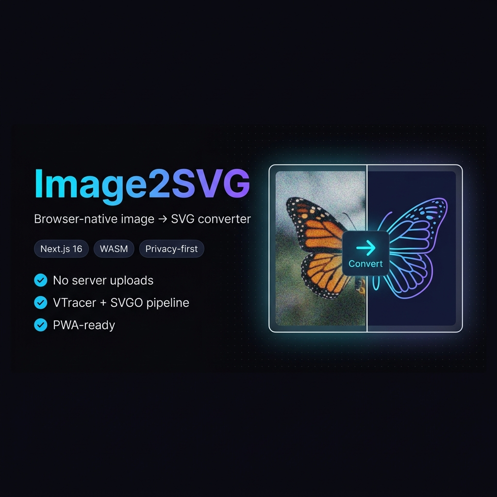

# Image2SVG



[](https://github.com/dipeshwalia/image2svg)
[](https://github.com/dipeshwalia/image2svg/fork)
[](https://github.com/dipeshwalia/image2svg/actions/workflows/ci.yml)
[](https://codespaces.new/dipeshwalia/image2svg)

Image2SVG is a browser-native image-to-SVG converter built with Next.js, TypeScript, and WebAssembly.

- No backend uploads required for core conversion flow.
- Client-side vectorization pipeline with optional optimization.
- Designed to be fast, private, and open for community extension.

## Features

- Raster image to SVG conversion in the browser.
- Pipeline architecture in `src/lib` for staged processing.
- SVG optimization pass via SVGO.
- PWA-ready app shell.

## Tech Stack

- Next.js 16 + React 19
- TypeScript (strict)
- VTracer WASM
- SVGO
- Vitest for unit tests

## Quick Start

1. Install dependencies:

```bash
pnpm install
```

2. Run dev server:

```bash
pnpm dev
```

3. Open:

`http://localhost:3000`

## Scripts

- `pnpm dev` — start local dev server
- `pnpm build` — production build
- `pnpm start` — start production server
- `pnpm lint` — run Oxc lint checks
- `pnpm lint:fix` — run Oxc lint fixes
- `pnpm format` — check formatting with Oxc formatter
- `pnpm format:write` — apply Oxc formatting
- `pnpm typecheck` — run TypeScript checks
- `pnpm test` — run unit tests
- `pnpm test:watch` — watch mode tests
- `pnpm test:coverage` — generate coverage report

## Testing

Unit tests live alongside source files (`*.test.ts`) in `src/lib`.

Run all tests:

```bash
pnpm test
```

## Contributing

Please read [`CONTRIBUTING.md`](./CONTRIBUTING.md) before opening a pull request.

Key expectations:

- Keep PRs focused.
- Add/update tests for behavior changes.
- Run lint, typecheck, and tests locally before submitting.
- Use clear commit messages and clean git history.

## Governance & Policies

- License: [`LICENSE`](./LICENSE)
- Code of Conduct: [`CODE_OF_CONDUCT.md`](./CODE_OF_CONDUCT.md)
- Security: [`SECURITY.md`](./SECURITY.md)

## CI

GitHub Actions runs lint, typecheck, tests, and build for pushes to `main` and pull requests.

## Roadmap Ideas

- Expand regression tests for vectorization edge cases.
- Add sample-image golden tests for output quality.
- Improve plugin-style extension points in the pipeline.
